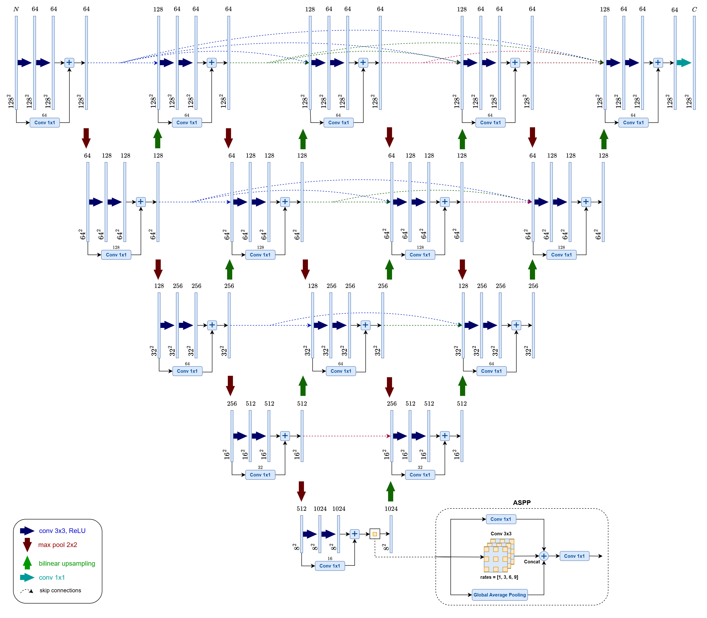
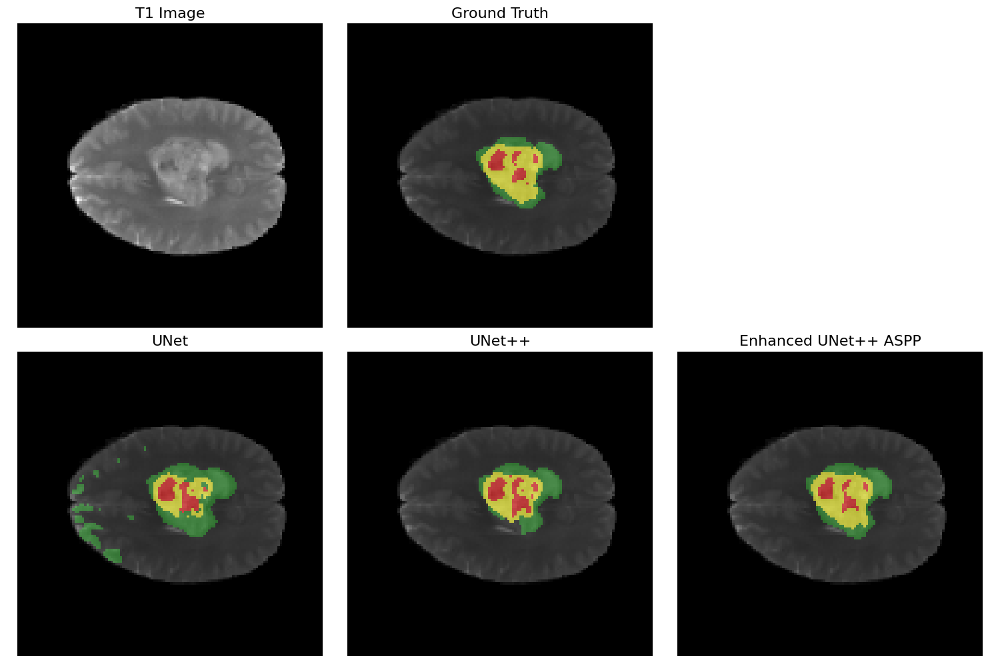

# Brain Tumor Segmentation on Enhanced UNet++ with ASPP

## Introduction

This project implements an enhanced UNet++ architecture for segmenting brain tumors in MRI scans. Enhancements include:

- Residual convolutional blocks for improved feature propagation.
- Extended downsampling connections to enrich multi-scale feature aggregation.
- Atrous Spatial Pyramid Pooling (ASPP) for better boundary delineation and contextual understanding.

The model is trained on the BraTS2020 dataset using a hybrid Dice + Cross-Entropy loss to address class imbalance between tumor and background regions, achieving improved segmentation performance in preliminary experiments.



## Installation

Install `Python 3.9-3.11`.

Run the following:

```bash
pip install torch==2.2.2 torchvision==0.17.2 torchaudio==2.2.2 --index-url https://download.pytorch.org/whl/cu118
pip install -r requirements.txt
```

## Usage

### 1. Preprocessing

- Download the [BraTS 2020 dataset](https://www.kaggle.com/datasets/awsaf49/brats20-dataset-training-validation)
- Extract the contents into the `./data/` directory
- Run `Preprocessing.ipynb` to generate processed datasets

> Alternatively, you can use the preprocessed data: `brats_train.pt`, `brats_val.pt`, and `brats_test.pt`

### 2. Training

- Open the corresponding model notebook (e.g., `Enhanced_UNetPP_ASPP.ipynb`)
- Run the training section to begin training
- Models and checkpoints are saved to `./checkpoints/`

> Pretrained models are also available in `./checkpoints/`

### 3. Testing

- In the same notebook, scroll to the Visualize section.
- Load the trained model, run inference on the test dataset, and visualize the predictions vs. ground truth for test images

## Training

- **Dataset**: BraTS2020 (multi-modal MRI: T1, T1c, T2, FLAIR)
- **Input Size**: 128 × 128
- **Preprocessing**:
  - Modalities stacked as 3 input channels: [T1ce, T2, FLAIR]
  - Intensity normalization applied per modality (zero mean, unit variance)
  - Images are resized to the target input size of 128 × 128 pixels
- **Loss Function**:
  - Hybrid loss: 0.5 × Dice Loss + 0.5 × Cross-Entropy Loss
  - Cross-Entropy is class-weighted using inverse class frequency
- **Optimizer**: Adam
- **Learning Rate**: 1e-3
- **Batch Size**: 32
- **Epochs**: 50

## Results

| Model                | DSC    | IoU    |
| -------------------- | ------ | ------ |
| UNet                 | 0.7616 | 0.6422 |
| UNet++               | 0.7857 | 0.6741 |
| Enhanced UNet++ ASPP | 0.8481 | 0.7428 |

Example segmentation outputs:


